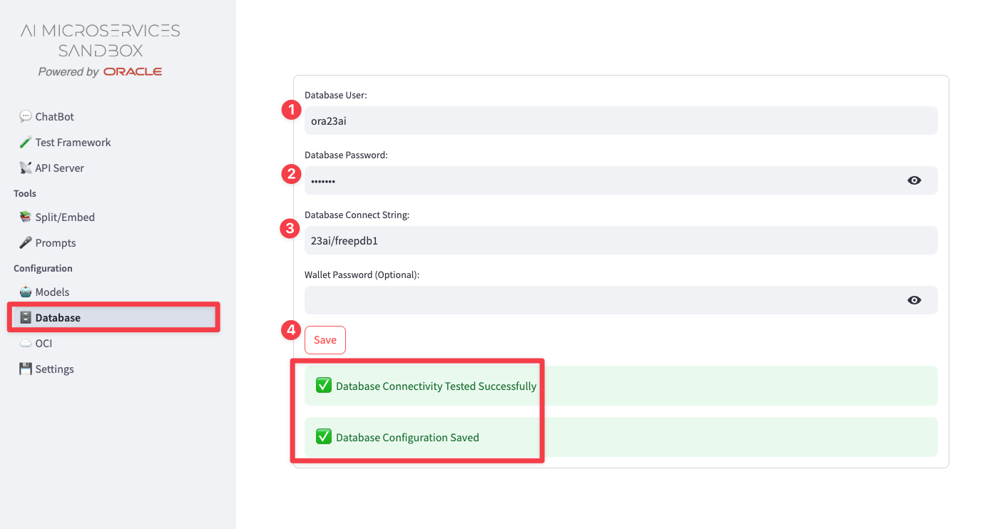
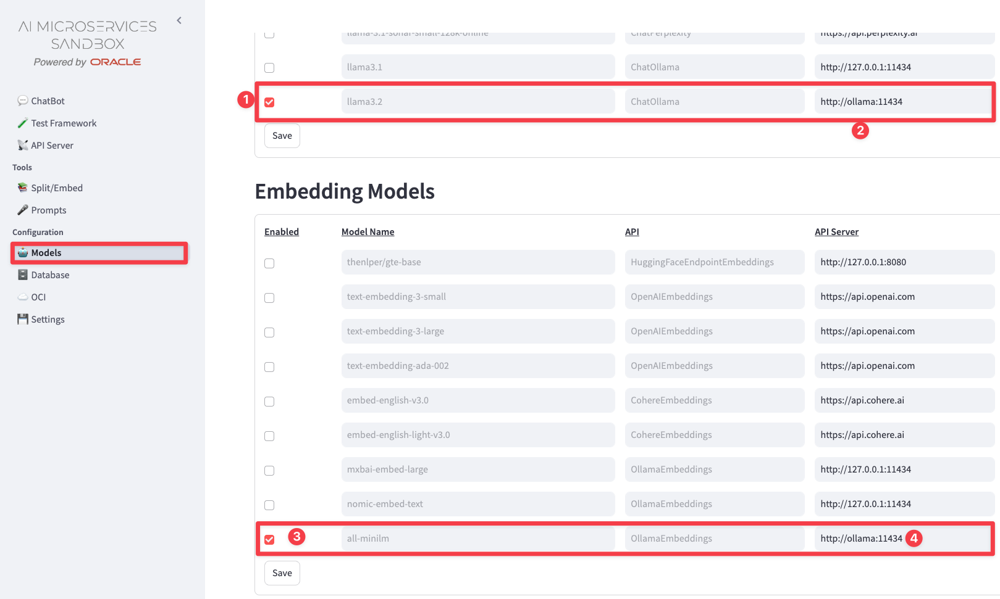
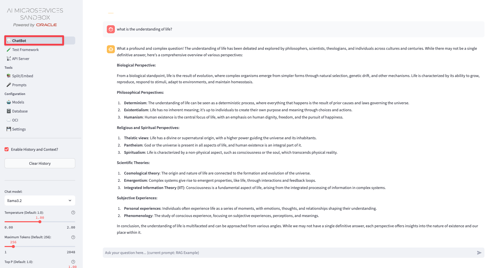

# 23aims-ollama
 23ai free with [AI Microservices Sandbox](https://oracle-samples.github.io/oaim-sandbox/) and Ollama.

 This docker compose setup, deploys the following container:

| Container Name | Service                                                                    |
| -------------- | -------------------------------------------------------------------------- |
| 23ai           | Oracle Database 23ai free                                                  |
| ords           | ORDS including APEX                                                        |
| sql            | SQLcl                                                                      |
| aims           | [AI Microservices Sandbox](https://oracle-samples.github.io/oaim-sandbox/) |


# Prerequisites
- Docker CE installed (include Docker Compose)
  - Note: Dependent on you installation the actual docker compose command might differ. This guide uses ```docker comppose```:
    - ```docker comppose``` or alternatively,
    - ```docker-compose```
- Note: I have not tested Podman. There may be some changes required to the compose.yml in order to make it with with podman-compose

# Get Started
After cloning the repo, run the deploy script:

```
./deploy.sh
```

The deploy script will make sure that you have a directory for the database files and that some directories have the appropriate access privileges.
It will also start the ```docker compose``` command.

Please note: The script starts docker compose in the foreground. If you prefer running it in the background modify the deploy.sh script by adding the flag ```-d``` to the docker compose command.

# Post Deployment DB Config
Once all containers are deployed, run the following command to start an interactive session in the SQLcl container:

```
sudo docker exec -it sql /bin/bash
```

Then start the init.sh script:

```
./init.sh
```

This script will load Oracle sample schemas (CO, SH, HR). 
It will also create the user ```ora23ai```.
All users will be ORDS-enabled.

| User Name   | Password    |
| ----------- | ----------- |
| **ora23ai** | **ora23ai** |
| admin       | Welcome23ai |
| co          | Welcome23ai |
| sh          | Welcome23ai |
| sys         | Welcome23ai |
| system      | Welcome23ai |


# Post Deployment Ollama Models
Now run the following command to start an interactive session in the Ollama container:

```
sudo docker exec -it ollama /bin/bash
```

Run:
```
ollama pull llama3.2
```

Once completed execute:

```
ollama pull all-minilm
```

Now, we have loaded llama3.2 LLM and the all-minilm embedding model.
Feel free to add other models.

# Start using AI Microservices Sandbox

Open the URL: http://<localhost:8501>

Replace localhost with the appropriate IP in case you are running this setup on a container.

Click on **database** and provide the database credentials as shown in the screenshot:


Then click on **Models** to enable Ollama as shown in the screenshot


Test the configuration by using the ChatBot:



Now you can upload PDF and create embeddings which are stored in the database.

If you want to see the tables login to the database using SQL Developer Web:

```http://<localhost:8181>/ords```


# Working with the container

When running docker compose in the foreground, you can gracefully stop all containers using CTRL+C.

You can restart all containers by entering:

```
sudo docker compose up
```

or to start in the background:

```
sudo docker compose up -d
```

You can stop selected containers:

For example, to stop the SQLcl container, type:

```
sudo docker compose stop sqlcl
```

If you want to restart a selected container, for example, SQLcl, simply type:

```
sudo docker compose up -d
```

If you want to remove all files related to this configuration, type:

```
sudo docker system prune --all
```
